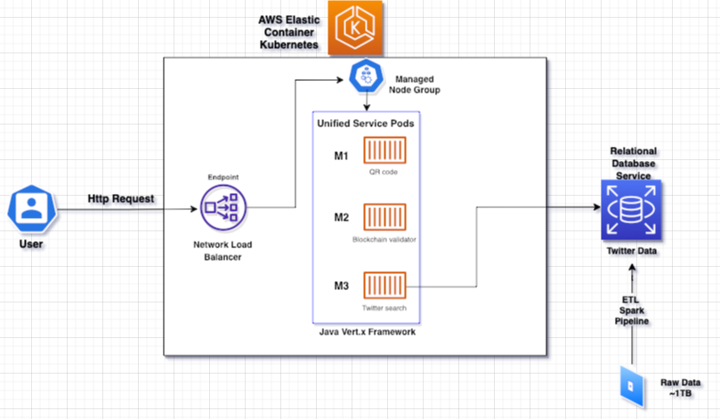
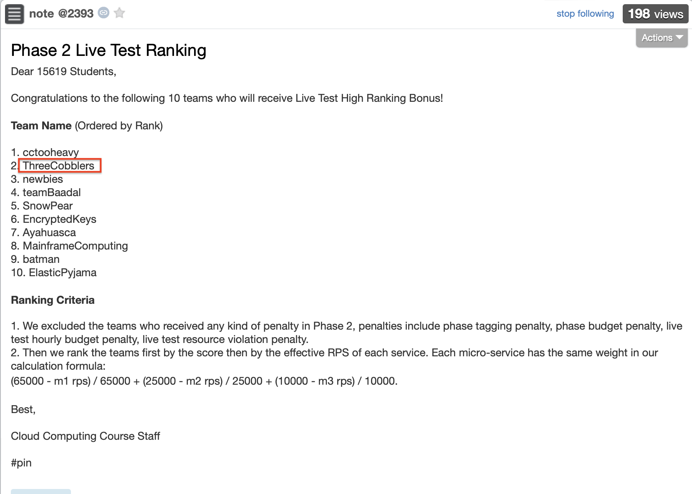

# ThreeCobblers - AWS Cloud Microservice

###### Init Time: Feb 22 2022
###### Last Updated: Apr 18 2022

---

Welcome to our [15619-Cloud Computing](https://www.cs.cmu.edu/~msakr/15619-s20/15319_15619_s20_Syllabus.pdf) final project repository!

Our team is named "**ThreeCobblers**"

Which comes an ancient Chinese proverb **"Three Cobblers could outperform Liang Zhuge (三个臭皮匠顶一个诸葛亮)"**, or equivalently "Two heads are better than one" in English.

It essentially states our belief that by collaborating together we three could make a successful project of excellence.

---

🌟Team member:

+ [Leo Guo](https://github.com/LeoGuo98)

+ [Benny Jiang](https://github.com/Bennyoooo)

+ [Yukun Jiang](https://github.com/YukunJ)

---

### Overview

In this project, developments are divided into three phases incrementally. The ultimate goal is to develop and deploy a fully-managed microservice cloud web service on AWS with extremely low latency, high throughput and fault tolerance.

**🌟Phase1🌟**: develop three invidiual services and host them on a webframe chosen. Test each service's performance individually

   Microservice 1 is about a QR Code encode and decode functionality where user sends a request containing the byte representation of the QR code and the web service encode/decode it accordingly and sends back the response. 

   Microservice 2 is computationally heavy that the web service needs to validate an existing blockchain and do work to append a new transaction verified onto it. 

   Microservice 3 involves both the web service and backend storage tier. The raw dataset of ~1TB twitter data is first cleaned and preprocessed using PySpark on Azure HDInsight cluster and loaded into the MySQL database. The web service will need to set up connections with backend database and query dynamically, and recommend high interaction scored friends back to the user.

**🌟Phase2🌟**: deploy all the three microservices using self-managed Kubernetes. Ends with a live test of hourly budget $0.7/hour

  Database schemea is divided into three tables in phase 1. However, when web service is handling a large volume of requests, it consumes a high amount of disk I/O burst credits and performance drops accordingly. Therefore a unified optimized schema is composed. 
  And in order to increase the throughput and lower latency, network load balancer (NLB) replaces default elastic load balancer (ELB).

**🌟Phase3🌟**: migrate the self-managed cluster to AWS fully-managed service. Ends with a live test of hourly budget $1.28/hour

  Originally in phase2 we deploy the microservice architecture as a self-managed Kubernetes cluster. Both the web-tier service and storage-tier database are deployed on EC2 instances and we have to consider how to place them so as to fully utilize the computational power and network transfer efficiency. In phase3, we migrate to a fully-managed architecture on AWS which eases the burden of management and enhances fault tolerance. We use Elastic Kubernetes Service (EKS) and Relational Database Service (RDS).

---

### Technology Stack

   Programming Language: Java, Python
   Framework: Vert.x, Spring Boot
   ETL: Spark
   Database: MySQL (InnoDB, MyISAM), Aurora
   Orchestration: Docker, Kubernetes, kOps
   Cloud: AWS (EC2, RDS, EKS), Azure (HDInsight)

---

### File Structure
    /etl-spark # the ETL Spark Code script
    /k8s # the self-managed Kops and helm script used in phase2
    /phase3-deployment # the folder for EKS cluster configuration, 
                         RDS and ALB Terraform scripts, Microservice Helm chart in phase3
    /pic # some auxiliary pictures
    /script # additional scripts to setup environment and test suite
    /web # the codes for three microservices 
    /phase1-checkpoint-report
    /phase1-final-report
    /phase2-final-report
    /phase3-final-report
    
---

### Microservice Architecture

The above graph is our final architecture for the microservice. The whole process of handling a user request is as follows:

0. We set up the EKS cluster with managed node group, backend RDS loaded with pre-ETLed data.
1. The user sends a HTTP service request to our service endpoint.
2. The request arrives at the network load balancer (NLB).
3. The NLB dispatches the request to one of the service pods in the cluster.
4. The pod selected handles the request by doing computations or querying the backend RDS.
5. The pod sends back the response to the client if the request is valid.

---

### Rankings

The project comes with two live test, one in Phase **2** and one in Phase **3**. There are in total **70** teams participating in the live tests, **3** CMU students per team.

In Phase **2**, we ranked **2nd**.

In Phase **3**, we believe we ranked **3rd**. The final rank is yet to be released soon.
